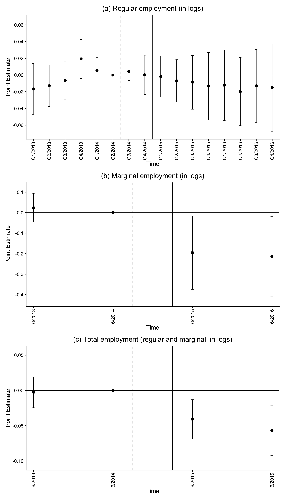
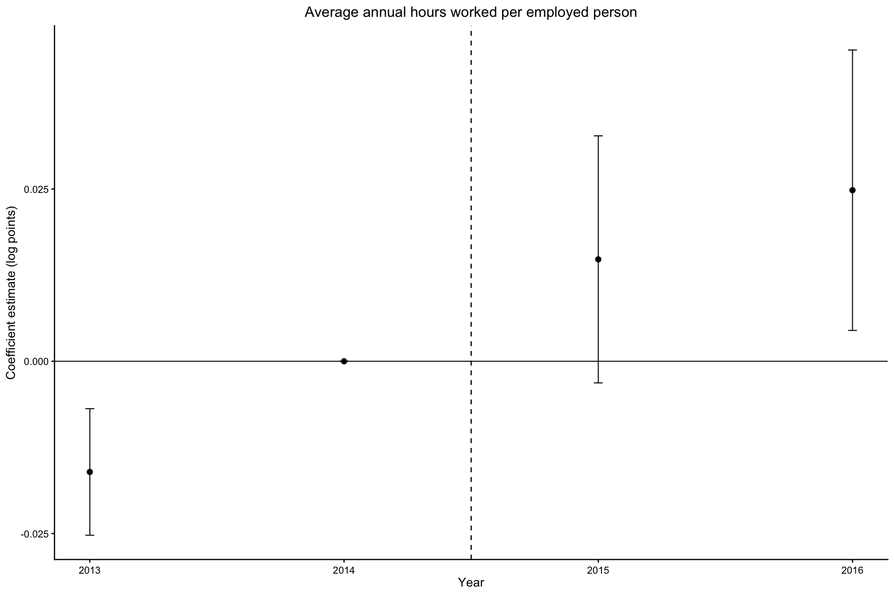

# Replication of Bonin et al. (2020) and Additional Analysis of Working Hours

## 1. Objective

This repository replicates the key empirical results of Bonin et al. (2020) using R. The replication was conducted for research and learning purposes, with a particular focus on understanding the original empirical design and translating the published Stata implementation into a transparent R workflow.

In addition to the replication, the repository includes an exploratory analysis of average annual hours worked per employed person to examine whether stronger minimum-wage exposure is associated with changes along the intensive margin of employment.

Building on this replication, a separate extension examines regional employment and unemployment developments around the 2017 German minimum-wage increase. The data, code, and results are available in the [extension repository](https://github.com/dorian-kenfack/german-minimum-wage-2017).

## 2. Original Study and Data

Bonin et al. (2020) study the effects of the introduction of the German statutory minimum wage in 2015 on regional employment and unemployment outcomes. Their empirical analysis is conducted at the level of German labor-market regions (AMRs) and exploits regional variation in minimum-wage exposure within a difference-in-differences framework.

Minimum-wage exposure is measured using the regional wage gap, constructed from pre-treatment wage information based on the 2014 Structure of Earnings Survey. Regions with a larger wage gap are interpreted as being more strongly exposed to the new wage floor.

The original replication dataset and Stata code are publicly available through the Journal of Economics and Statistics data archive and form the basis of the replication in this repository.

## 3. Replication Strategy

The analysis covers 2013–2016 and replicates two empirical approaches. In the binary difference-in-differences models, AMRs with a pre-treatment wage gap above the median form the higher-exposure treatment group, while the remaining AMRs form the lower-exposure comparison group. In the continuous event-study specifications, the regional wage gap enters directly as a continuous measure of minimum-wage exposure.

The original Stata specifications were translated into R using `fixest`. All models include AMR and time fixed effects, use population weights, and cluster standard errors at the AMR level.

Following the original implementation, the treatment period begins in July 2014 (Q3/2014), corresponding to the announcement of the minimum-wage legislation. This timing allows for potential anticipatory adjustments before the minimum wage became effective on January 1, 2015.

For the binary difference-in-differences models, five specifications are replicated:

1.  Baseline model with AMR and time fixed effects.
2.  Additional East-West-specific seasonal or trend controls.
3.  Additional East-West and AMR-type-specific time effects.
4.  Additional trends based on pre-treatment regional characteristics. (preferred specifiacation)
5.  Specification 4 estimated on a trimmed sample that excludes regions with the most extreme wage gaps.

Several implementation details were not fully transparent from the published paper and were therefore reconstructed from the original Stata code. In particular, annual outcomes require a different treatment of East-West trends than quarterly outcomes, and the preferred specification combines several sector-specific trends with time-varying interactions based on pre-treatment regional characteristics. The trimmed sample matches the sample size reported in the original study. When using the supplied CSV data, reproducing the original sample size requires including observations equal to the upper cutoff at the 90th percentile (≤), whereas the original Stata code uses a strict inequality (\<). The source of this boundary discrepancy remains unresolved.

## 4. Replication Results

The R replication reproduces the main empirical findings of Bonin et al. (2020). The binary difference-in-differences models cover the outcomes and specifications reported in Tables 1 and 2 of the original study. The table below compares the estimates from the preferred specification 4.

| Outcome                       | Bonin et al. (2020) |    R replication |
|-------------------------------|--------------------:|-----------------:|
| Regular employment            |    -0.0010 (0.0021) | -0.0010 (0.0022) |
| Marginal employment           |    -0.0180 (0.0071) | -0.0180 (0.0071) |
| Exclusive marginal employment |    -0.0194 (0.0093) | -0.0194 (0.0093) |
| Total employment              |    -0.0056 (0.0022) | -0.0056 (0.0022) |
| Unemployment                  |      -0.007 (0.006) |   -0.007 (0.006) |

*Notes:* Entries report treatment coefficients with standard errors clustered at the AMR level in parentheses. Results refer to Specification 4 and are displayed at the precision reported in the original tables. Significance stars are omitted to focus on the numerical comparison.

Across Tables 1 and 2, all treatment coefficients match the published estimates at the reported precision. Clustered standard errors also match except in three cases in Table 1: Panel A, Specification 4 (0.0021 in the original versus 0.0022 in R); Panel C, Specification 5 (0.0093 versus 0.0094); and Panel D, Specification 3 (0.0024 versus 0.0025). The first discrepancy is visible in the comparison above; the other two concern specifications not displayed here. The source of these small differences remains unresolved.

The descriptive trends in Figure 3 of the original study were also replicated, including the separate treatment and comparison group developments for regular employment, marginal employment, and unemployment.

[View the replicated descriptive trends](figures/figure_3.png).

Finally, the continuous event-study specifications underlying Figures 4 and 5 of the original study were reproduced in R following the original Stata implementation. The resulting coefficient paths and confidence intervals closely match the published figures. The figure below presents the replicated employment event studies corresponding to Figure 4 of the original study.



*Notes:* Points indicate coefficient estimates; error bars show 95% confidence intervals based on standard errors clustered at the AMR level. The reference period is Q2/2014 for quarterly outcomes and 2014 for annual outcomes. The dashed vertical line marks July 2014, and the solid vertical line marks January 2015. Panel (b) refers to exclusively marginal employment.

[View the replicated unemployment event study](figures/figure_5.png).

## 5. Additional Analysis: Average Hours Worked

The original study finds no statistically significant effect on regular employment, but a statistically significant reduction in marginal employment. One possible adjustment mechanism beyond employment changes is that firms in more strongly exposed regions may have partly offset higher hourly labor costs by reducing hours worked per employee. Motivated by this hypothesis, the extension examines whether higher regional minimum-wage exposure is associated with a decline in average annual hours worked per employed person.

To explore this possibility, an additional annual outcome was constructed measuring average hours worked per employed person at the AMR level. The measure is calculated by dividing total annual hours worked by the total number of employed persons within each AMR. The analysis covers 2013–2016 and applies annual analogues of the original preferred specification in both a binary difference-in-differences model and a continuous event-study design.

For the working-hours analysis, 2013–2014 are classified as pre-treatment years and 2015–2016 as post-treatment years, using the implementation in January 2015 as the annual treatment cutoff. Since working hours are measured over the full calendar year, the 2014 observation may already include anticipatory adjustments following the announcement in July 2014.

The binary difference-in-differences estimate from the annual analogue of the preferred specification is reported below.

| Model      | Estimate | Clustered SE | Observations | AMRs |
|------------|---------:|-------------:|-------------:|-----:|
| Binary DiD |   0.0033 |       0.0016 |        1,028 |  257 |

*Notes:* The dependent variable is the log of average annual hours worked per employed person. Standard errors are clustered at the AMR level. The model uses population weights and covers 257 AMRs from 2013 to 2016.

The binary DiD estimate corresponds to approximately 0.33% higher average annual hours worked in higher-exposure regions relative to lower-exposure regions after implementation, conditional on the model controls.

The continuous event study complements the binary DiD estimate by showing how the association between regional minimum-wage exposure and average annual hours worked varies across years, relative to the reference year 2014. It also allows an assessment of differential developments before treatment.

```{r working-hours-event-study, echo=FALSE, out.width="100%", fig.cap="*Notes:* The figure reports coefficients from the continuous annual event-study specification. Coefficients represent differences in log average annual hours worked per employed person associated with a one-unit increase in the regional wage gap, relative to 2014. The reference-year coefficient is normalized to zero. Vertical bars show 95% confidence intervals based on standard errors clustered at the AMR level. The dashed vertical line separates the pre-treatment years (2013–2014) from the post-treatment years (2015–2016)."}

```

Taken together, the estimates do not support the hypothesis that more strongly exposed regions experienced a reduction in average annual hours worked. The binary DiD estimate is positive, and the post-treatment event-study coefficients also point to more positive developments relative to 2014. However, the statistically significant coefficient for 2013 indicates a differential pre-treatment development, raising concerns about the parallel-trends assumption. These results should therefore be interpreted as descriptive regional associations rather than causal effects of the minimum wage.

## 6. Repository Structure

The repository is organized to separate the final analysis inputs from original data, code, and generated figures.

``` text
├── README.md
├── README.Rmd
│
├── code/
│   ├── analysis.R
│   ├── functions.R
│   └── original/
│       └── replicationboninetal2019.do
│
├── data/
│   ├── original/
│   │   ├── mlkamrpanel.csv
│   │   └── readme_bonin.txt
│   │
│   ├── final/
│   │   ├── AMR_Working_Hours_2013_2016.csv
│   │   └── AMR_Working_Hours_2013_2016_README.md
│   │
│   └── raw/
│       ├── mappings/
│       │   └── BBSR_Arbeitsmarktregionen_2017_Original.csv
│       └── README.md
│
└── figures/
    ├── figure_3.png
    ├── figure_4.png
    ├── figure_5.png
    └── working_hours.png
```

`analysis.R` contains the complete R replication and the additional working-hours analysis, while `functions.R` contains reusable plotting functions. The original replication dataset and Stata code provided by Bonin et al. (2020) are preserved unchanged in `data/original/` and `code/original/`. The `data/final/` directory contains the dataset constructed for the additional working-hours analysis, and `figures/` contains the reproduced figures generated by the analysis.

## 7. Reproducing the Analysis

The main replication can be reproduced directly from the original dataset provided in `data/original/`. The dataset used for the additional working-hours analysis is provided in `data/final/`.

The analysis was run using R version 4.6.0 and requires the following packages:

``` r
install.packages(c("fixest", "dplyr", "ggplot2", "patchwork"))
```

To reproduce the results:

1.  Clone or download the repository.

2.  Set the working directory to the repository root.

3.  Run:

``` r
source("code/analysis.R") 
```

The main script automatically loads the helper functions contained in `code/functions.R`.

The analysis uses:

- `data/original/mlkamrpanel.csv`, containing the original AMR panel used for the replication of Bonin et al. (2020).

- `data/final/AMR_Working_Hours_2013_2016.csv`, containing the annual AMR-level data used for the additional working-hours analysis.

Running the script reproduces the reported regression results and regenerates all final figures contained in the `figures/` directory.

## 8. Data Sources

The main replication uses the original dataset and Stata code provided by Bonin et al. (2020) through the [Journal of Economics and Statistics data archive](https://doi.org/10.15456/jbnst.2019261.133530). The original files are preserved unchanged in `data/original/` and `code/original/`.

The additional working-hours dataset was constructed from official district-level data provided by the [Arbeitskreis Erwerbstätigenrechnung der Länder](https://www.statistikportal.de/de/etr/publikationen). Information on employed persons and annual working hours was aggregated from the Kreis level to labor-market regions (AMRs) using the [BBSR 2017 regional mapping](https://www.bbsr.bund.de/BBSR/DE/forschung/raumbeobachtung/Raumabgrenzungen/downloads/archiv/download-referenzen.html).

The resulting AMR-level dataset for 2013–2016 is provided in `data/final/AMR_Working_Hours_2013_2016.csv`. Further information on its construction and variable definitions is documented in the accompanying README file.

## 9. Limitations

The replication relies on the publicly available data and Stata implementation provided by Bonin et al. (2020). Some details of the original specifications were not fully documented in the paper and therefore had to be reconstructed from the original `.do` file.

The additional working-hours analysis is exploratory. The event-study estimates show differential pre-treatment developments, which limits the credibility of a causal interpretation.

Moreover, average annual hours worked at the AMR level may reflect changes in employment composition, full-time and part-time shares, and statistical modeling of regional working hours, rather than changes in individual working hours alone.

## 10. References

Bonin, H., Isphording, I. E., Krause-Pilatus, A., Lichter, A., Pestel, N., & Rinne, U. (2020). The German Statutory Minimum Wage and Its Effects on Regional Employment and Unemployment. *Journal of Economics and Statistics*, 240(2–3), 295–319. DOI: 10.1515/jbnst-2018-0067.

Bonin, H., Isphording, I. E., Krause-Pilatus, A., Lichter, A., Pestel, N., & Rinne, U. (2020). *The German Statutory Minimum Wage and Its Effects on Regional Employment and Unemployment replication data*. Journal of Economics and Statistics Data Archive, Version 1. DOI: 10.15456/jbnst.2019261.133530.

Arbeitskreis Erwerbstätigenrechnung der Länder. (2026). *Reihe 2: Kreisergebnisse für Deutschland, Band 2: Arbeitsvolumen in den kreisfreien Städten und Landkreisen der Bundesrepublik Deutschland 2000 bis 2024*. Ergebnisse der Revision 2024, Berechnungsstand August 2025.
